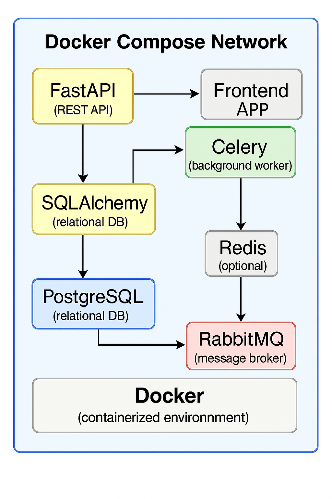

# FastAPI Microservice with Celery, Redis, RabbitMQ, PostgreSQL, and SQLAlchemy

This is a fully containerized Python backend project built with FastAPI for REST APIs, Celery for background tasks, PostgreSQL with SQLAlchemy ORM for relational data, Redis as a message broker/cache, and RabbitMQ for queueing. The app supports async routes and database migrations via Alembic.

---

## 🚀 Features

- FastAPI with async support
- SQLAlchemy ORM (sync or async)
- Celery for background task processing
- Redis or RabbitMQ as Celery broker
- PostgreSQL for data persistence
- Docker + Docker Compose setup
- Alembic for DB migrations
- Health check route
- Custom exception handling

---

## 🛠️ Tech Stack

| Layer        | Technology            |
|--------------|------------------------|
| API          | FastAPI (async)       |
| Background   | Celery                |
| Messaging    | Redis / RabbitMQ      |
| Database     | PostgreSQL + SQLAlchemy |
| Migrations   | Alembic               |
| Container    | Docker + Compose      |

---

## 📂 Project Structure
.
├── app/
│ ├── main.py # FastAPI entrypoint
│ ├── api/ # Route handlers
│ ├── celery_tasks/ # Celery tasks
│ ├── crud/ # DB access logic
│ ├── db/ # DB init, models, session
│ ├── schemas/ # Pydantic models
│ └── worker.py # Celery worker starter
├── alembic/ # DB migrations
├── Dockerfile
├── docker-compose.yml
├── requirements.txt
└── README.md

---
## 🧭 Architecture Diagram



## 🐳 Run with Docker

### 1. Build and start all services
```bash
docker-compose up --build
```
### 2. Run Alembic migrations
- Inside the running container:
```bash
docker-compose exec fastapi alembic upgrade head
```
## 🔥 Example API Endpoint
- Visit: http://localhost:8000

## Sample GET route:
- GET / -> { "message": "Hello FastAPI" }

## 🧪 Sample Celery Task
- You can send a background task using:

```bash
from celery_tasks.tasks import add
add.delay(2, 3)
```
## 🛡 Health Check
- GET /health -> { "status": "ok" }

## ✅ Environment Variables (example)
- Create a .env file (or pass via docker-compose)

```bash
POSTGRES_DB=postgres
POSTGRES_USER=postgres
POSTGRES_PASSWORD=postgres
POSTGRES_PORT=5432
POSTGRES_HOST=db

REDIS_HOST=redis
RABBITMQ_HOST=rabbitmq
```
## 🧑‍💻 Author
## Ninaad Sanjay Bagul 
* Python Developer | Backend Engineer
💼 GitHub

## 📝 License
- MIT License - feel free to use and modify.